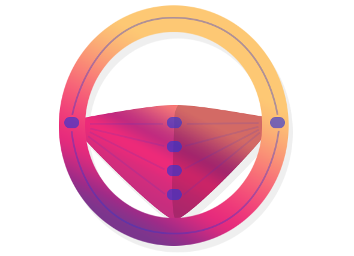
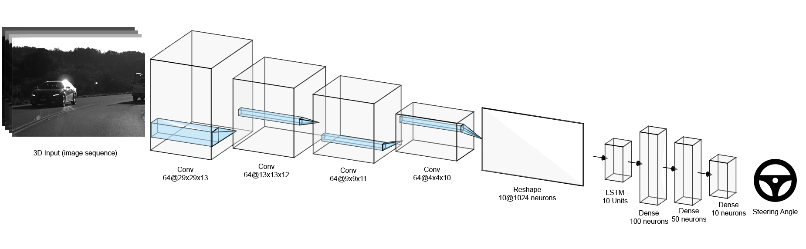
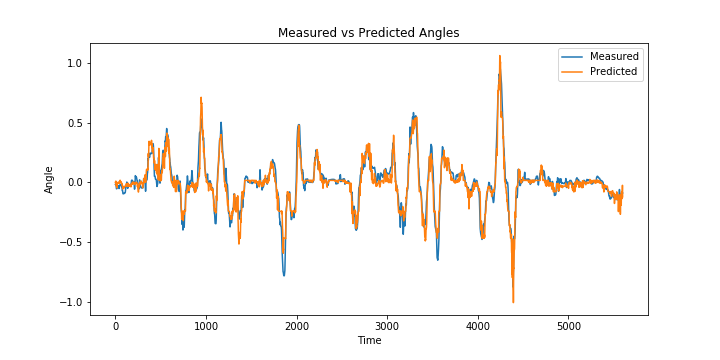
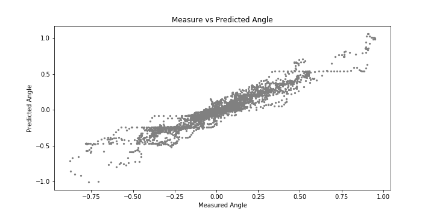

# Steering Wheel Predicition using Deep Learning

This project aims to build a system on top of a CNN model that will be able to control the angle of the steering wheel only.

# Model Architecture

We’ve tried to design the model architecture depending on the nature of the data and the problem itself, and since the data was a video footage, we thought about it as a sequence of images, and what suits this type of data is <b>Recurrent Neural Networks (RNN)</b>, thus we’ve constructed a <b>CNN-LSTM</b> model.

A <b>CNN-LSTM</b> model consists of two models. First, the CNN model which takes the input images and perform <b>feature extraction</b>. Second, comes the RNN model which takes the feature map sequences produced by CNN and learn the patterns, hopefully this part will learn the dynamics of driving a car.
  
The the input was splitted into a sequence of 15 consecutive images, the sequence at time t is the set of images {t, t-1, t-2 ... t-14}. The sequences was constructed first then shuffled since the data has a high correlation between adjacent samples, shuffling the training data was mandatory. The LSTM will see a sequence of 10 samples, since the other 5 will be eaten by the convolutional layers.
  
During building this model, we’ve tried so many tricks such as *residual connections* between convolutional layers which boosted the performance and made the layers avoid the problem of vanishing gradients. We’ve used ReLU non-linear activation function to speed up the training process. No regularization were used but dropout with keep probability of 25% between every convolutional layer and fully-connected layers except the last one. Batch normalization was used after all the convolutional layers. We’ve noticed that after using max-pooling rather than strides the model was able to achieve a lower MSE by 11%.
  
In the training process we’ve optimized the model for 100 epochs, and used checkpoints to save the model that has the least test error, also we’ve lowered Adam optimizer’s learning rate to *0.0005* which gave us better performance, and since the data can’t fit in memory we’ve used mini-batch gradient descent with 20 batch size.

# Results & Evaluation
The model was able to achieve an *RMSE* of *0.0678*, and was able to generalize well the unseen data, and was surprisingly able to predict the angle of steep turns with only a few examples. we’ve plotted the predicted and the measured angles (ground truth), and as you can see the model was able to predict steep turns (large angles) almost perfectly.
 
 

  
We can see that the predicted values and the measured values have high correlation, which indicates that the model was able to generalize well.

# Future Work
We believe that further tuning will definitely give better result, and the model will benefit from additional data, one method for providing additional data is to use GAN models to generate more images of steep turns, and winter/rainy weather from the existing summer weather.